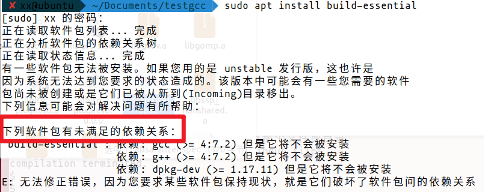
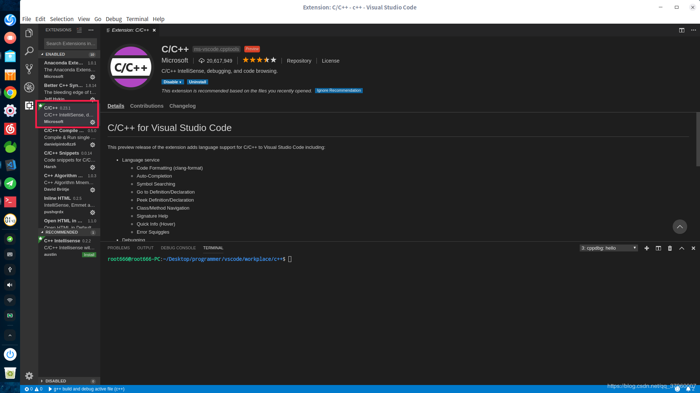
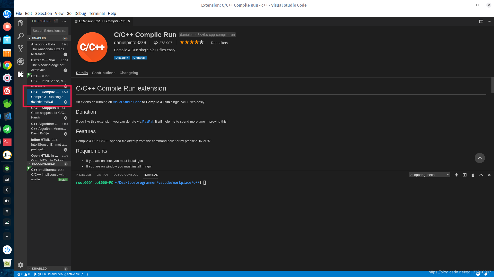
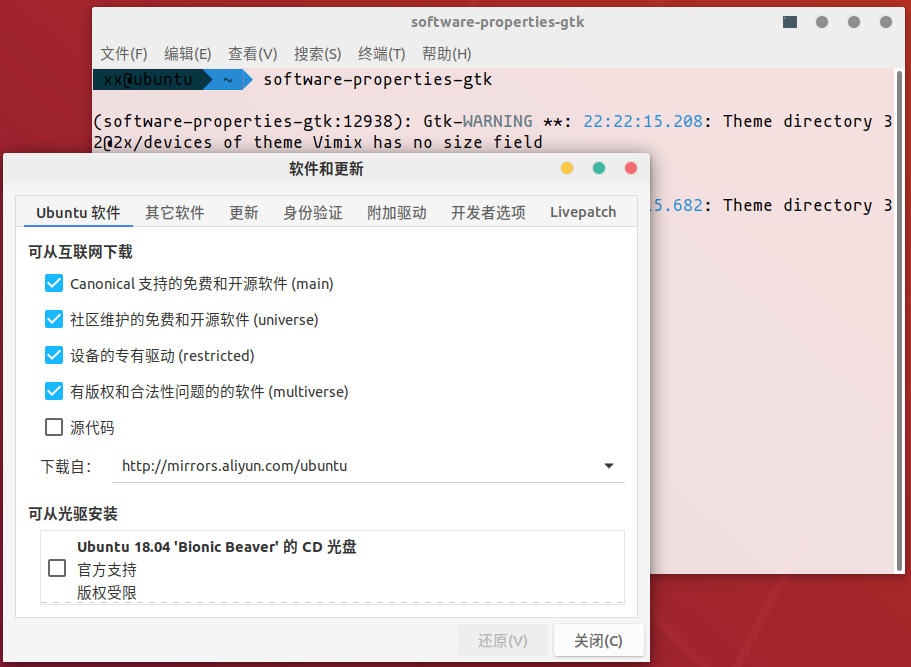
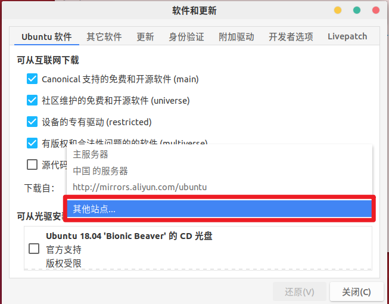
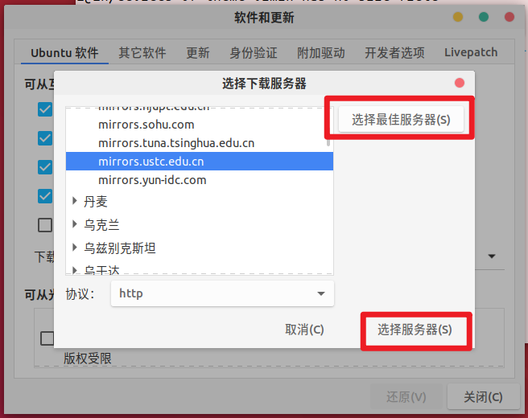
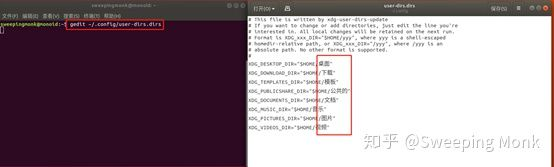
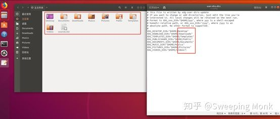

# Ubuntu18 使用技巧集

@[TOC](---请按需自取---)


## 问题

### 所安装程序的依赖包不兼容

截图中就是一个例子。

> build-essential : 依赖: gcc (>= 4:7.2) 但是它将不会被安装
>                    依赖: g++ (>= 4:7.2) 但是它将不会被安装
>                    依赖: dpkg-dev (>= 1.17.11) 但是它将不会被安装

凡是遇到类似问题，括号里面会是一些版本号。这通常代表的意思是Ubuntu自生安装的软件包版本高，而所安装软件的依赖包版本低的原因。



解决：

先安装aptitude

``` bash
sudo apt-get install aptitude
```
然后使用使用以下命令安装**所需程序**

```bash
sudo aptitude install build-essential #要替换build-essential为自己所需的程序
```
① 出来第一次让你选择  y/n  ,此时方案为保留当前版本的软件包不做更改，选择 n。
② 接下来给出的是降低版本的解决方案， y/n 选择 y。
③ 将自己在终端安装软件的命令再打一遍，例如我截图第一行。查看是否正确安装。

## 教程

### 使用VSCode在Linux下快速搭建c++环境

① 检查是否有gcc/g++编译程序和gdb调试程序。

```bash
sudo apt-get install gcc
sudo apt-get install g++
sudo apt-get install gdb
```

② 安装所需插件。





③ 编写hello.cpp测试。

F5 调试

F6 运行


### 更换软件源

> 软件源：软件源是ubuntu系统的应用程序安装仓库，使用apt安装软件的时候，系统会从软件源处寻找、下载软件包，自动安装。ubuntu系统的软件源配置目录位于`/etc/apt/sources.list`文件和`/etc/apt/sources.list.d`目录下。

#### 方法一

默认的软件源使用国外的服务器，更新下载速度较慢，可以使用ubuntu的`软件与更新`工具选择一个更新最快的服务器。

如果找不到`软件与更新`可以按如下操作打开。

使用快捷键 <kbd>Ctrl</kbd>+<kbd>Alt</kbd>+<kbd>T</kbd> 打开终端（或者在桌面上右击-打开终端，后文直接称为 **打开终端**）。在终端输入`software-properties-gtk`，回车即可打开软件和更新。



点击 **下载自** 右边的下拉框，选择 **其他站点**。在弹出的界面中点击**选择最佳服务器**。





等待测试完成后点击**选择服务器**，完成后输入当前用户密码，重新载入软件包缓存。

注意：在换源后需要在终端输入

```bash
sudo apt update		#更新软件源目录
sudo apt upgrade	#更新所有软件
```

#### 方法二

另一种简单的换源方式是直接修改 `/etc/apt/sources.list`，首先备份当前配置，在终端输入 `sudo cp /etc/apt/sources.list ~` 将配置文件复制到家目录下，然后使用文本编辑器（如nano，vim，gedit）打开 `/etc/apt/sources.list` 文件，将其中的内容修改为：

> deb http://mirrors.ustc.edu.cn/ubuntu/ bionic main restricted universe multiverse
> deb http://mirrors.ustc.edu.cn/ubuntu/ bionic-security main restricted universe multiverse
> deb http://mirrors.ustc.edu.cn/ubuntu/ bionic-updates main restricted universe multiverse
> deb http://mirrors.ustc.edu.cn/ubuntu/ bionic-proposed main restricted universe multiverse
> deb http://mirrors.ustc.edu.cn/ubuntu/ bionic-backports main restricted universe multiverse
> deb-src http://mirrors.ustc.edu.cn/ubuntu/ bionic main restricted universe multiverse
> deb-src http://mirrors.ustc.edu.cn/ubuntu/ bionic-security main restricted universe multiverse
> deb-src http://mirrors.ustc.edu.cn/ubuntu/ bionic-updates main restricted universe multiverse
> deb-src http://mirrors.ustc.edu.cn/ubuntu/ bionic-proposed main restricted universe multiverse
> deb-src http://mirrors.ustc.edu.cn/ubuntu/ bionic-backports main restricted universe multiverse

修改该文件的方法为：在终端输入 `sudo gedit /etc/apt/sources.list`

### 将家目录设为英文

如果使用中文语言安装系统，在家目录下会生成如 **下载**、**桌面**、**文档** 等目录，在终端中切换目录的时候中文目录会影响效率，因此可以考虑将这些目录都修改为英文目录。修改家目录下目录的方法是修改 `~/.config/user-dirs.dirs`，文件。

打开终端，执行 `gedit ~/.config/user-dirs.dirs` 打开用户目录配置文件。



修改该文件，将中文目录修改为对应的英文名称。

然后打开文件管理器（点击左栏第二个图标，或在终端输入`nautilus ~`），将**文件管理器**中的对应目录修改为对应的英文名，再重启电脑。
**注意上文有两次修改！！**




### 卸载不再依赖的包 命令

```bash
sudo apt-get autoremove
```

### 清理linux无用的依赖包或软件（转）

可以使用以下命令清理系统垃圾

```bash
sudo apt-get autoclean 
```

清理旧版本的软件缓存

```bash
sudo apt-get clean 
```

清理所有软件缓存

```bash
sudo apt-get autoremove 
```

删除系统不再使用的孤立软件执行

```bash
sudo nautilus /boot
```

删除除了最新内核以外的其它文件，（比如2006-08-17 官方内核是 26，那就可以删除所有 23,25结尾的旧内核文件）

整理grub启动菜单

```bash
sudo gedit /boot/grub/menu.lst
```

删除除最新内核以外的其它启动项（如23,25等）

－－－－－－－－－－－－－－－－－－－－－－－－－－－－－－－－

Ubuntu Linux与Windows系统不同，Ubuntu Linux不会产生无用垃圾文件，但是在升级缓存中，Ubuntu Linux不会自动删除这些文件，今天就来说说这些垃圾文件清理方法。

1，非常有用的清理命令：

```bash
sudo apt-get autocleansudo apt-get cleansudo apt-get autoremove
```

这三个命令主要清理升级缓存以及无用包的。

2，清理opera／ firefox的缓存文件：

```bash
ls ~/.opera/cache4

ls ~/.mozilla/firefox/*.default/Cache
```

3，清理Linux下孤立的包：

图形界面下我们可以用：gtkorphan

```bash
sudo apt-get install gtkorphan -y
```

终端命令下我们可以用：deborphan

```bash
sudo apt-get install deborphan -y
```

4，卸载：tracker

这个东西一般我只要安装Ubuntu就会第一删掉tracker 他不仅会产生大量的cache文件而且还会影响开机速度。所以在新得利里面删掉就行。

5，删除多余的内核：一定不要删错哦，切记！！

打开终端敲命令：

```bash
dpkg --get-selections|grep linux
```

有image的就是内核文件

删除老的内核文件：

sudo apt-get remove 内核文件名 （例如：linux-image-2.6.27-2-generic）

内核删除，释放空间了，应该能释放130－140M空间。

最后不要忘了看看当前内核：uname -a

附录：

包管理的临时文件目录:

包在

/var/cache/apt/archives

没有下载完的在

/var/cache/apt/archives/partial


## 小知识

1. 安装deb程序包

   ```bash
   sudo dpkg -i xxx.deb
   ```

2. 检查程序更新并更新

   ``` bash
   sudo apt update		#更新软件源目录
   sudo apt upgrade	#更新所有软件
   ```

3. `sudo xxx` 表示以其他用户身份（一般为超级用户root）运行后面的指令，系统级别的操作（如更新系统、修改系统文件等）一般都需要有超级用户权限。

4. `cd 目标地址` 表示在目标地址下执行。

5. `cp 源目标 目的地址` 表示将源目标复制一份到目的地址，若源目标为目录，则需要使用 -r参数。

6. `~` 表示家目录，是用户自己的目录，一般为 **/home/用户名**目录，root用户的家目录为**/root。**

7. apt ：ubuntu的软件包管理器，使用apt可以方便快捷地安装常用软件，它可以自动解决依赖问题。

8. 依赖：Linux系统下，一个软件包（A）可能使用了另一个软件包（B）提供的功能，此时成为软件包A依赖软件包B，如果没有安装软件包B而直接安装软件包A，则安装可能失败。

9. dpkg：是专门为“Debian”开发的套件管理系统（ubuntu基于Debian），方便软件的安装、更新及移除。dpkg 不能自动解决依赖关系。使用dpkg安装deb包的方式是：`sudo dpkg -i xxx.deb`。
   在dpkg安装出现依赖问题的时候，使用 `sudo apt -f install` 有可能可以解决依赖关系（如果所依赖的软件包在软件源中都能找到）。


## MarkDown 技巧

过 `Shift + Enter` 完成

使用 <kbd>Ctrl</kbd>+<kbd>Alt</kbd>+<kbd>Del</kbd> 重启电脑


